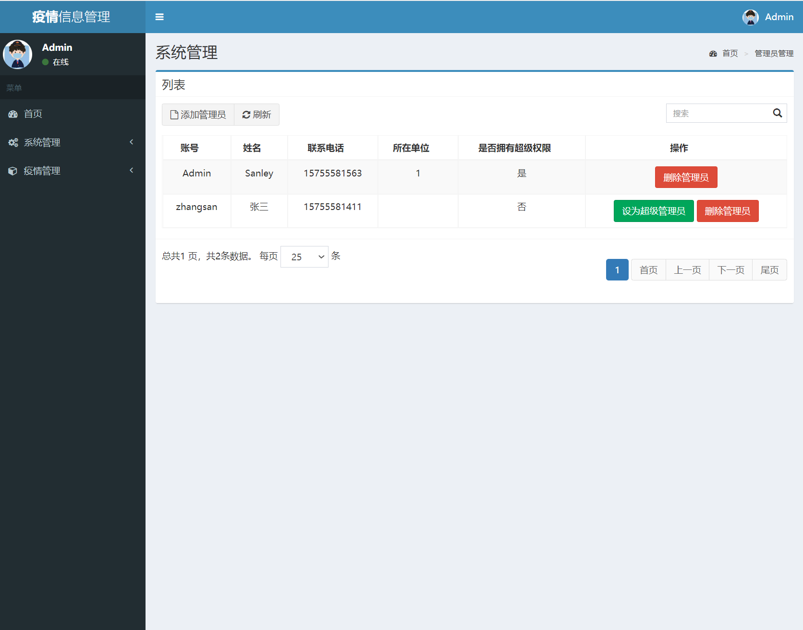
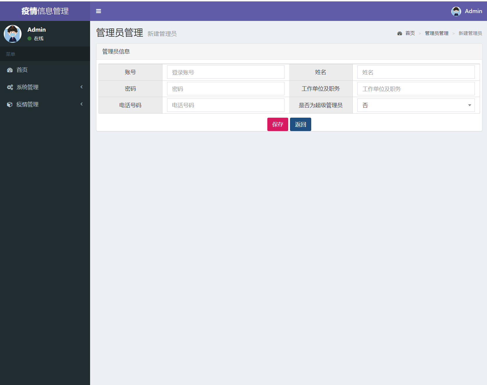
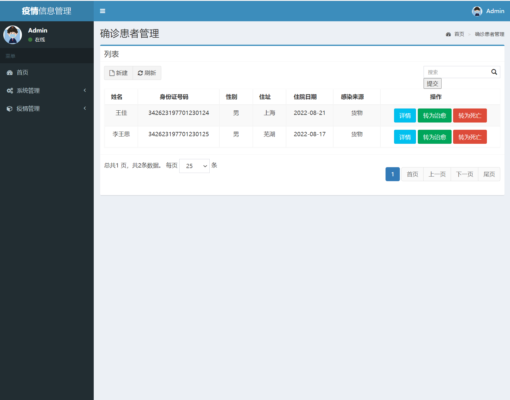
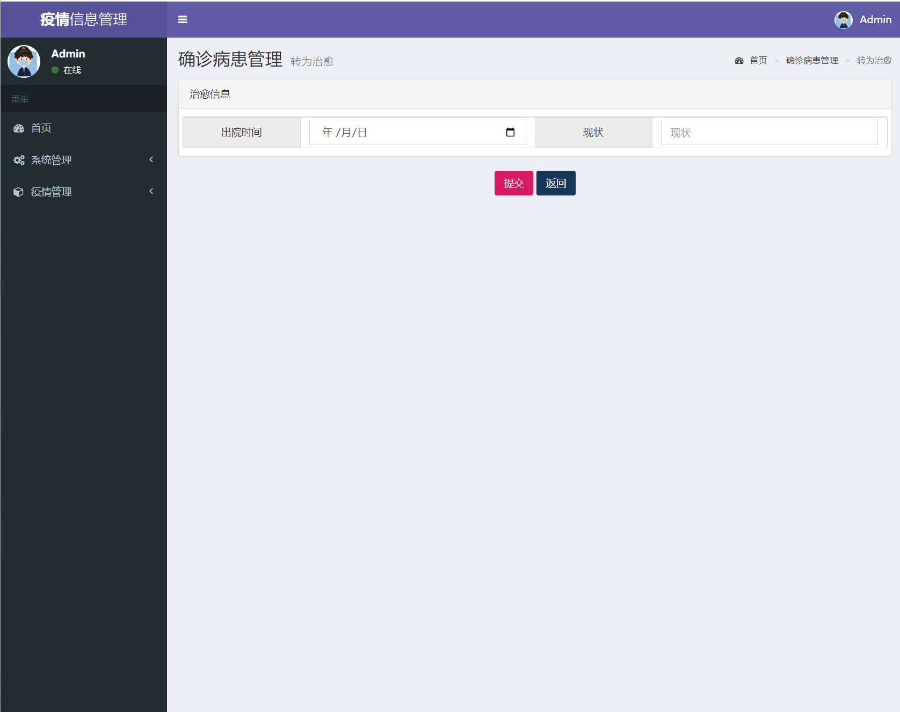
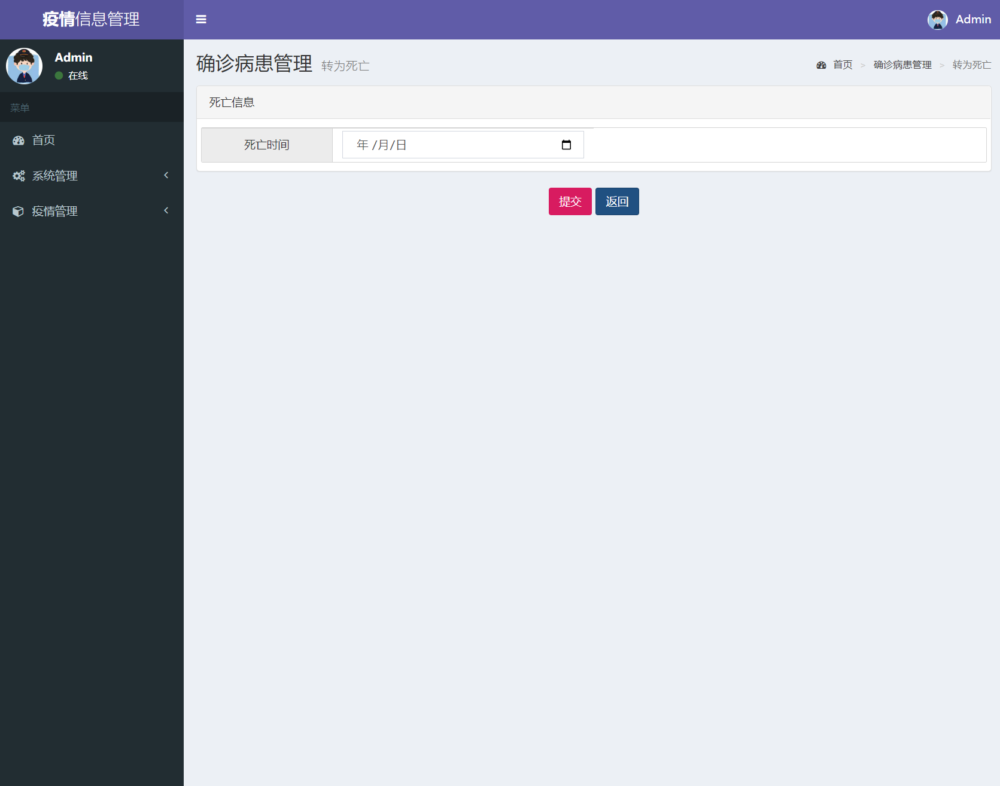
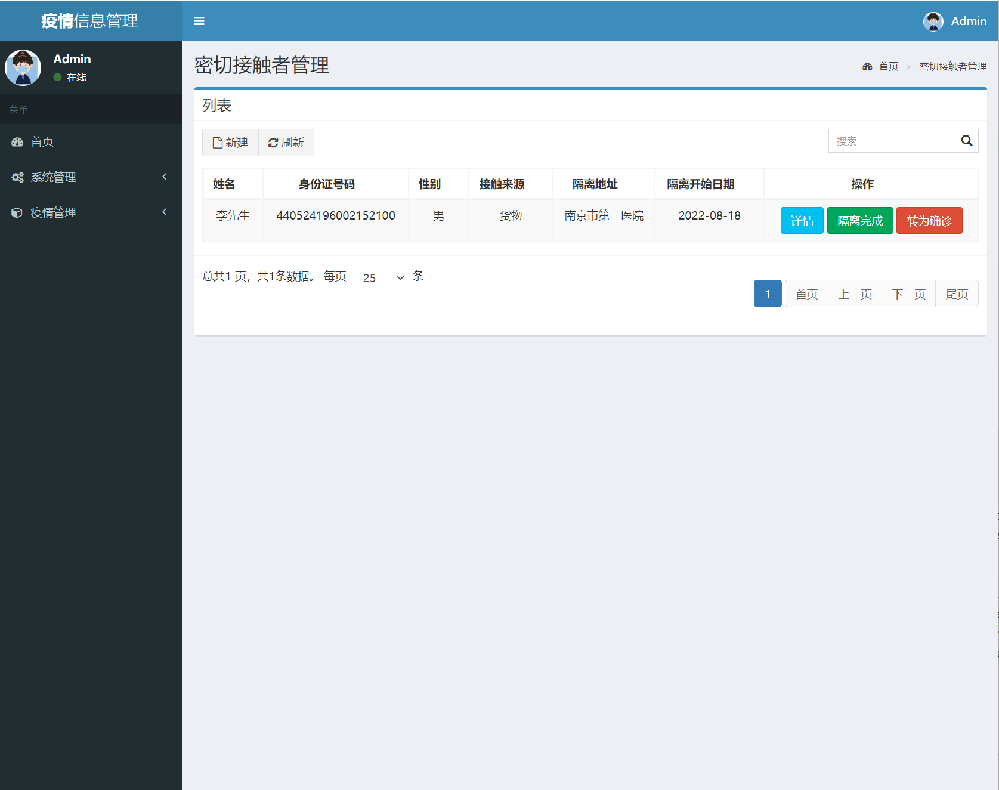
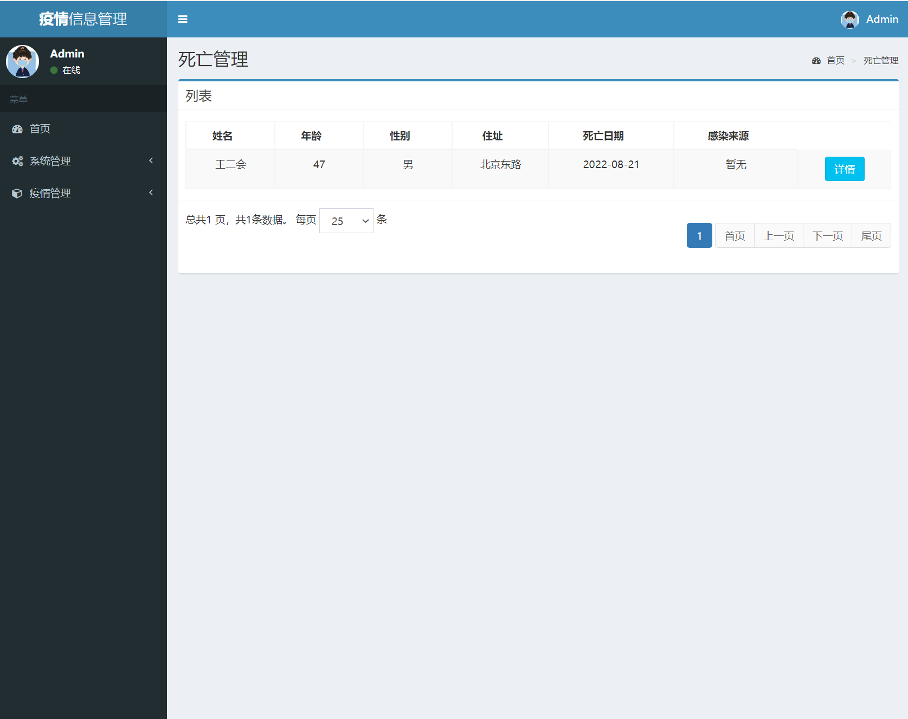
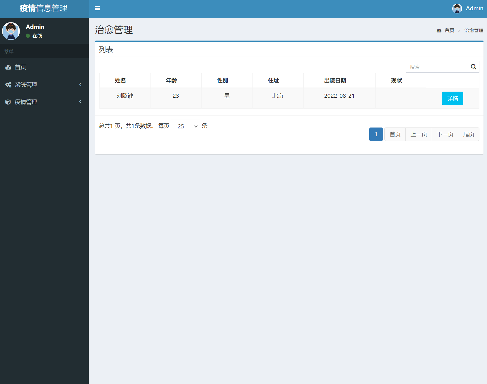

### 作者QQ：1556708905(支持修改、 部署调试、 支持代做毕设)

#### 支持代做任何毕设论、接网站建设、小程序、H5、APP、各种系统等

**毕业设计所有选题地址 [https://github.com/zhengjianzhong0107/allProject](https://github.com/zhengjianzhong0107/allProject)**

**博客地址：[https://blog.csdn.net/2303_76227485/article/details/128662316](https://blog.csdn.net/2303_76227485/article/details/128662316)**

**视频演示：[https://space.bilibili.com/384537280](https://space.bilibili.com/384537280)**

## 基于SpringBoot及thymeleaf搭建的疫情信息管理系统  (源码+数据库脚本)

## 一、系统介绍

疫情信息管理系统应当具备两种对象，疫情管理员对象可以对确诊患者、密切接触者、死亡患者、治愈患者的信息进行管理操作，

系统管理员对象在疫情管理员对象的功能基础上可以对系统登录用户进行增删改查。针对需求分析设计了具体模块，系统功能模块图如下图所示。

抗疫管理员登录后可以进行确诊患者管理、密切接触者管理、死亡管理、治愈管理，同时可以看到数据面板的数据变化与动态图。系统管理员除了拥有抗疫管理者的权限，还可以对抗疫管理员进行管理。

密切接触者可以转换成确诊患者；确诊患者可以转换成死亡患者或者治愈患者，业务流程图如下图2-1。

## 二、所用技术

SpringSecurity SpringBoot Mysql Mybatis Thymeleaf  echarts

## 三、环境介绍

基础环境 :IDEA/eclipse, JDK 1.8 , Mysql,

所有项目以及源代码本人均调试运行无问题 可支持远程调试运行

## 四、页面截图

## 五、浏览地址

前端访问地址：http://localhost:8002/indexpage

管理员账号/密码：Admin/123456  

## 六、安装教程

1. 使用Navicat或者其它工具，在mysql中创建对应名称的数据库，并导入项目的sql文件；
2. 使用IDEA/Eclipse/MyEclipse导入项目，Eclipse/MyEclipse导入时，若为maven项目请选择maven;
   
   若为maven项目，导入成功后请执行maven clean;maven install命令，然后运行； 
